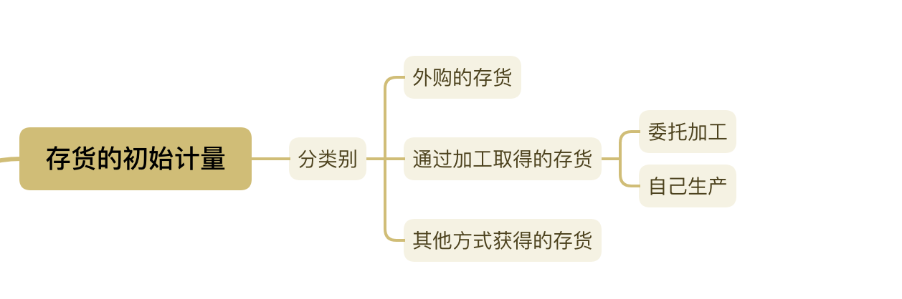
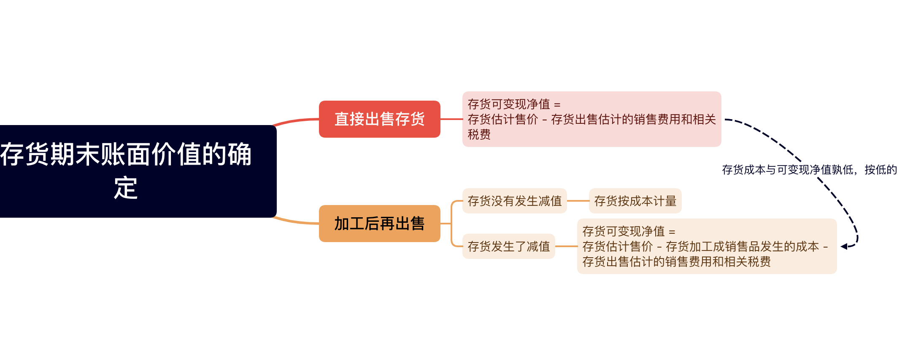

# 第一章 存货

> 存货，是指企业在日常活动中持有的：
> 1. 产成品
> 2. 商品
> 3. 在产品
> 4. 生产或者提供劳务消耗的材料

## 确认条件

1. 与该存货有关的经济利益很可能流入企业。
2. 该存货成本能够可靠的计量.

## 计量

### 初始计量

#### 外购的存货

企业存货从采购到入库前所发生的全部指出：
1. 买价
2. 相关税费: 进口关税、消费税、资源税和不能抵扣的增值税进项税额。(可以抵扣，就不计入成本,一般纳税人可以抵扣，小规模不能抵扣，才能计入成本)
3. 运费
4. 装卸费
5. 保险费
6. 其他:采购过程中发生的仓储费、包装费、运输过程的合理损耗、入库前整理费等。

#### 生产加工获得的存货

##### 1. 委托加工

由：发出材料的实际成本、加工成本、运杂费、消费税 等等组成。消费税就交一次，如果后续还要加工就后续再交。

##### 2. 自己生产

由：投入的原材料或半成品、直接人工、按照一定方法分配的制造费用。

#### 其他方式获得的存货

按照投资合同或者协议约定的价值确定，但是协议或者合同约定的价值必须公允。

***

### 期末计量

#### 存货期末计量的原则

资产负债表日，存货应当按照成本与可变现净值孰低计量。当存货的成本高于可变现净值豆，应当集体存货跌价尊卑，计入当期损益（资产减值损失）。

> 可变现净值：存货的估计售价 - 卖出要产生的成本（销售费用、相关税费等等）

#### 可变现净值的确定

##### （一）企业确定存货的可变现净值时应考虑的因素

1. 确凿的证据，要根据实际的市场销售价格来确定可变现净值，不能自己随便瞎掰。
2. 持有存货的目的，直接出售和加工后再出售的存货的可变现净值确认方式不同。
3. 资产负债表日后事项的影响

##### （二）不同情况下存货可变现净值的确定

#### 存货跌价准备的计提与转回

